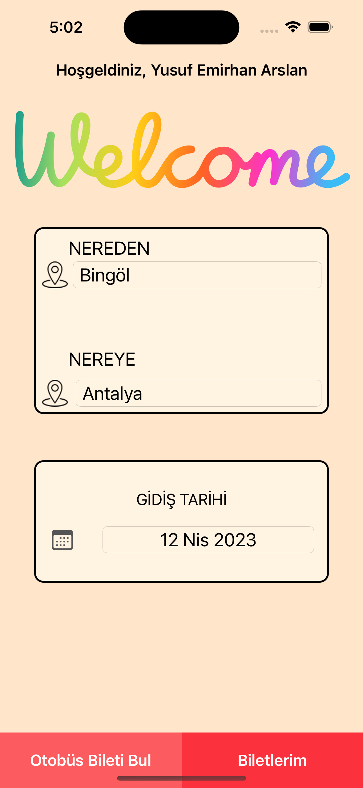
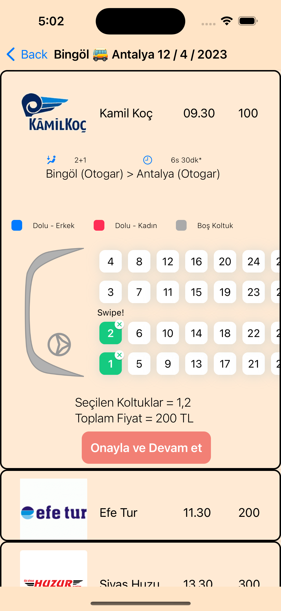
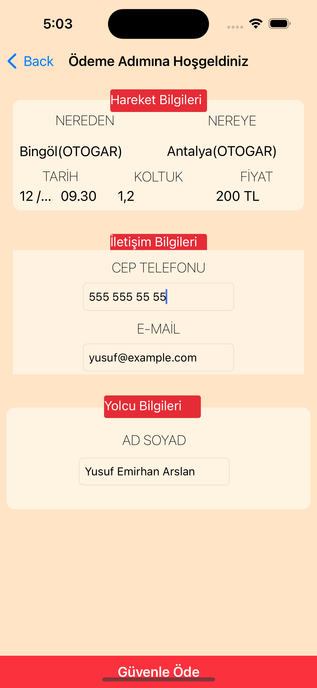
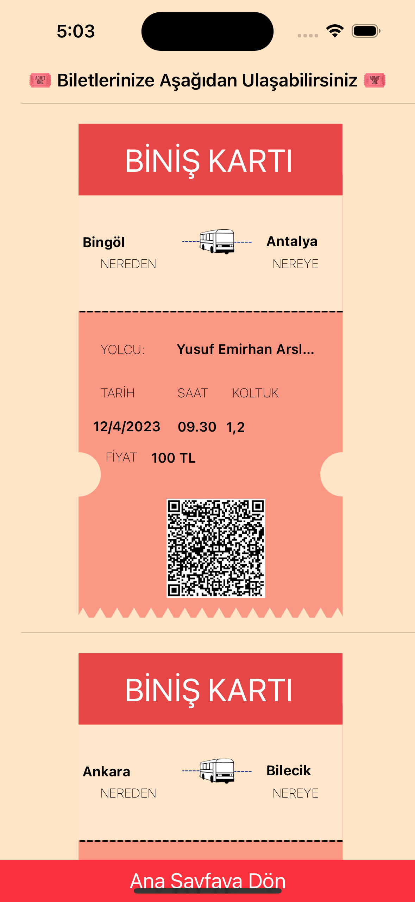

# **Bus Ticket App**
 
 Otobüs bileti alma uygulaması.
 
 ## Uygulamanın Tanıtımı
 - :round_pushpin: Kullanıcı uygulamayı kullanabilmesi için önce kayıt ol **(signup)** butonundan kayıt olmalı. 
 - :round_pushpin: Eğer başarılı kayıt olabilirse giriş **(login)** ekranına geliyor. 
 - :round_pushpin: Kayıt olduğu mail adresi ve şifresi yazdığı bilgilerle doğru eşleşirse kullanıcı ana sayfaya yönlendiriliyor. 
 - :round_pushpin: Ana sayfada kullanıcı önceki biletlerine ulaşabiliyor. Eğer yeni bilet alacaksa gideceği, varacağı yeri ve tarihi seçerek **"otobüs bileti bul"** tuşuna basarak bilet arayabilir.
 - :round_pushpin: Otobüs firmalarının listelendiği sayfada kullanıcı istediği firmanın üstüne basınca çıkan koltuklardan istediğini seçebilir. Kullanıcı seçme işlemini bitirdikten sonra **"Onayla ve Devam et"** butonuna basarak ödeme sayfasına yönlendiriliyor.
 - :round_pushpin: Kullanıcı ödeme sayfasında gerekli bilgileri doldurmadan ödeme işlemini gerçekleştiremiyor. Eğer tüm bilgiler doğru girildiyse kullanıcı biletlerin listelendiği sayfaya yönlendiriliyor.
 - :round_pushpin: Biletlerin listelendiği sayfada kullanıcı aldığı tüm biletleri görüntüleyebiliyor. Qr kodu okutarak da seyahat bilgilerini görüntüleyebiliyor.
   
## Uygulamanın Tanıtım Videosu
 - Uygulamanın tanıtım videosuna emojiye basarak ulaşabilirsiniz. [🎬](https://youtu.be/8nUfTGmWx6g)
   
## Onboarding Sayfası
 
 
 
 

## Login ve Signup Sayfası

 
 
 
 ## Ana sayfa
 

 ## Otobüs Firmalarının Listelendiği Sayfa
 

 ## Ödeme Sayfası
 

 ## ALınan Biletlerin Listelendiği Sayfa
 
